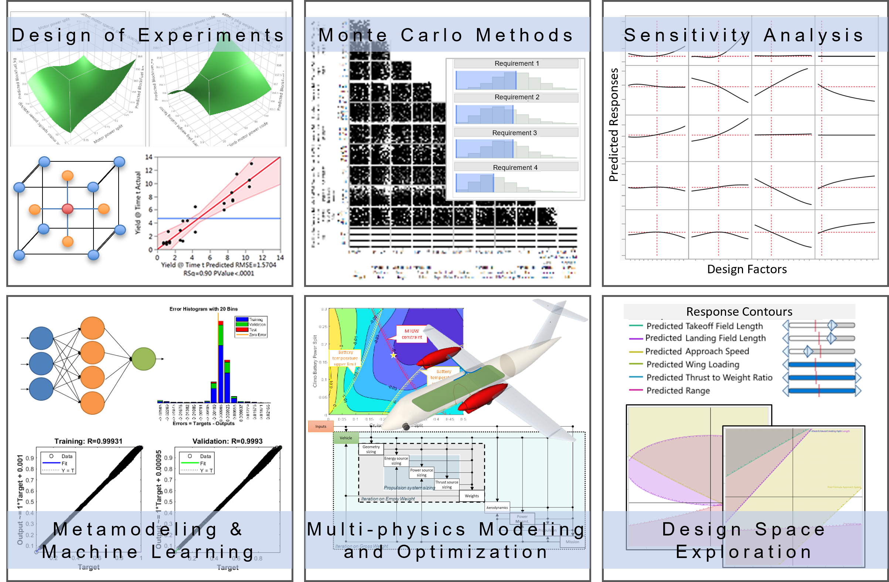



Research at the IDEAS Lab aims to bring a **holistic approach** that accounts for the **system-level and life-cycle** impact of the **design and operation of novel aircraft on the environment**. Revolutionary technologies, such as electrified propulsion and hydrogen combustion, open up a new and exciting design space with many challenges and uncertainties. At IDEAS Lab, we use **physics-based modeling**, **probabilistic and statistical methods**, and **systems engineering** **principles** **to analyze, understand and design the complex system behavior** of an aerospace vehicle. We leverage **probabilistic design methods to** **reduce the uncertainty** associated with novel concepts in early design phases. We build **reduced order models** to expedite the analysis and simulation of large-scale systems. These techniques allow us to perform **sensitivity analysis, visualize tradeoffs,** and **explore a vast and uncharted design space under varying constraints at the early design stages.**

## Research topics include:
- Aerospace systems design, integration, optimization
- Sustainable aviation with a special focus on electrified and hydrogen-powered aircraft concepts
- Statistical and probabilistic design methods
- Surrogate modeling and machine learning
- Model-based systems engineering

## Core capabilities:

### Future Aircraft Sizing Tool (FAST)
The Future Aircraft Sizing Tool (FAST) is a versatile open-source, MATLAB-based software developed by the IDEAS Lab at the University of Michigan. FAST is designed for rapid design space exploration and analysis of both conventional and electrified aircraft concepts, supporting any propulsion architecture. With minimal input requirements, FAST allows users to provide only basic details such as range, payload, vehicle class, and propulsion system type to begin designing. Utilizing a continuously updated historical database of over 200 aircraft and engines, FAST employs Gaussian Process Regressions to predict unknown parameters and make future projections. This tool supports both fully electric and hybrid electric aircraft, offers detailed mission performance analysis, and provides integrated visualizations of aircraft geometry and propulsion architecture. For more information and to start using FAST, visit our [**FAST page**](/software/fast/) or access the [**GitHub repository.**](https://github.com/ideas-um/FAST)

### Electrified Propulsion Architecture Sizing and Synthesis: E-PASS
Developed by Dr. Cinar, E-PASS is an energy-based aircraft sizing and synthesis tool in MATLAB. **E-PASS enables conceptual design and performance evaluation of advanced aircraft concepts with *any* type of propulsion architecture** (including non-electrified), and allows for rapid comparisons between **diverse architectures *and* their operations**. E-PASS is powered by **parametric, physics-based** electric powertrain models. It serves as a **modular multi-disciplinary analysis and optimization** framework for **novel aircraft conceptual design**. Since 2018, the E-PASS software has enabled multiple research projects funded by the government and industry, including NASA, AFRL, and Boeing.

### Design Space Exploration and Optimization
Traditionally, important design decisions are made and locked in at early design stages where knowledge about the design is limited and the methods rely on historical data. This results in a point design that can only be locally optimized for a predetermined set of requirements. At IDEAS Lab, we leverage **probabilistic design methods** to predict the effects of **random variability** and **mitigate uncertainties** associated with novel concepts. We strategically and efficiently **sample and perturb the design space of a complex system** to predict the system response including the **random variability effects**. We utilize statistical methods to build **computationally faster reduced order models**. This approach enables the creation of a **fast, dynamic, and interactive design space exploration and optimization environment**. This way we can perform the simulation and evaluation of *thousands* of sized designs, optimized under varying requirements - all of this *at the click of a button*! This environment can be used to perform **"what-if" analysis, visualize the sensitivities** of design factors to the system-level responses, make **informed decisions** about the design, and more.

